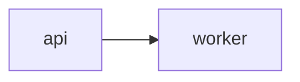

# Architecture Diagrams

Each architecture diagram consists of two files:

1. A **Mermaid** file (`.mmd`) containing the diagram definition.
2. An optional **Context** file (`context.json`) containing rich metadata for nodes, edges, and groups.

## File References in .uigraph.yaml

```yaml
architectureDiagrams:
  - name: Login Flow
    path: .uigraph/diagrams/login-flow/login-flow.mmd
    contextPath: .uigraph/diagrams/login-flow/context.json
```

## Mermaid File

Standard Mermaid syntax. Supported diagram types:

- `flowchart` and `graph`
- `stateDiagram-v2`
- `sequenceDiagram`
- `C4Context`, `C4Container`, `C4Component`, `C4Dynamic`, `C4Deployment`

The first diagram keyword in the file picks the pipeline that converts it, and each pipeline produces its own node IDs.

A file whose first diagram keyword is `sequenceDiagram` is converted by the sequence pipeline, which has its own syntax surface and a different context key scheme. See `references/sequence-diagrams.md` before writing one; the rest of this file describes flowchart-style diagrams.

A file whose first diagram keyword starts with `C4` is converted by the C4 pipeline. Node IDs are the element aliases, so `Person(user, "User")` is keyed as `user` in `context.json`. Do not hand-write C4 diagrams to describe a system that a flowchart already describes well. Write one when the user asks for C4 specifically, or when the repository already documents itself in C4 terms. The most reliable C4 pair comes from the UiGraph diagram editor: draw or adjust the diagram there and use **Export To Mermaid**, which writes the `.mmd` and its context file together.

`stateDiagram-v2` keeps the named states and the transitions between them. The `[*]` start and end markers are not nodes and do not appear in `context.json`.

Node IDs in the Mermaid file must match keys in `context.json` when context is provided.



```json
{
  "nodes": {
    "api": { "type": "cloud", "name": "API Gateway" },
    "worker": { "type": "component", "name": "Order Worker" }
  }
}
```

## Context Behavior

The converter uses context fields to change node types, add component fields, resolve icons, and style existing nodes. Do not add `groups` by default; most diagrams should use nodes and edges only.

- `nodes[<node-id>]` applies only when `<node-id>` matches a Mermaid node ID.
- `name` creates or updates a hidden `Name` component field.
- `data` entries create or update component fields by label.
- `style.width` and `style.height` set node dimensions when present.
- Node style fields `fill`, `stroke`, `strokeWidth`, `strokeStyle`, `borderRadius`, and `borderAnimationEnabled` are copied into node data.
- Node `borderAnimationEnabled` also sets `strokeAnimation` to `dash`.
- `edges["<source>-<target>"]` applies only when source and target match the converted Mermaid edge.
- `groups` is optional and should be omitted unless the source project or user request gives an explicit boundary to represent, such as a named deployment zone, trust boundary, bounded context, network segment, team ownership area, or compliance/security boundary.
- `groups[<group-id>]` must be an **object**, never an array of node IDs. The converter rejects the array form with `groups.<id>: Expected object, received array`.

```json
{
  "groups": {
    "private-subnet": { "name": "Private Subnet", "nodes": ["api", "worker"] }
  }
}
```

Incorrect, and the most common mistake:

```json
{
  "groups": {
    "private-subnet": ["api", "worker"]
  }
}
```

## Node Behavior

`type` is optional; a node without one stays a default node. Pick a node or custom type (`shape`, `cloud`, etc.) when it makes sense for the node.

- `cloud` sets the node type to `cloud`, forces `150x150`, and resolves an icon from `cloud` plus exact `service` name when possible.
- `text` uses `value` to create the `Text` component field.
- `code` uses `value` to create the `Code` component field.
- `table` uses `table.columns`, `table.rows`, and `name` for rendered table content.
- `data-source` and `db-table` both convert to the database table node type and use `dbConfig`. `dbConfig` requires three name-based fields (not IDs): `serviceName`, `databaseName`, and `tableName`.
- `databaseTableSQL` is the round-trip database table node type.
- `component` converts to a `builder` node and sets `componentId`; use it when it makes sense or the user asks for it.
- `builder` can preserve full component field metadata during round-trip; use it when the user asks for it.
- `shape` sets `data.shape`; `or` and `summing-junction` are forced square with a minimum size of `200`.
- `image` uses `src` as the image source.
- `gif` uses `animatedIcon` for known animated assets or `src` for direct GIF URLs.
- `comment` is useful for review notes and unresolved diagram annotations.
- `sequenceParticipant` is produced automatically for participants in a `sequenceDiagram` file; never set it by hand as a context `type`. See `references/sequence-diagrams.md`.
- `groups` supports only `name` and `nodes`, both optional; group bounds are calculated from referenced nodes. A group value is always an object, so a group that only lists members is written as `{ "nodes": [...] }`.

## Node Context Examples

Before generating context for a node type, review the matching skill-owned example file.

| Node or context type | Example file |
|----------------------|--------------|
| `cloud` | `assets/templates/diagram-context/cloud-nodes.context.json` |
| `text` | `assets/templates/diagram-context/text-nodes.context.json` |
| `code` | `assets/templates/diagram-context/code-nodes.context.json` |
| `table` | `assets/templates/diagram-context/table-nodes.context.json` |
| `data-source`, `db-table`, `databaseTableSQL` | `assets/templates/diagram-context/database-nodes.context.json` |
| `component`, `builder` | `assets/templates/diagram-context/component-builder-nodes.context.json` |
| `shape` | `assets/templates/diagram-context/shape-nodes.context.json` |
| `image` | `assets/templates/diagram-context/image-nodes.context.json` |
| `gif` | `assets/templates/diagram-context/gif-nodes.context.json` |
| `comment` | `assets/templates/diagram-context/comment-nodes.context.json` |
| `sequenceParticipant` | `assets/templates/diagram-context/sequence-participant-nodes.context.json` |
| `groups` | `assets/templates/diagram-context/group-context.context.json` |
| `data` field types | `assets/templates/diagram-context/component-field-types.context.json` |

## Shape Values

- `rectangle`
- `rounded-rect`
- `ellipse`
- `diamond`
- `triangle`
- `parallelogram`
- `trapezoid`
- `hexagon`
- `document`
- `cylinder`
- `delay`
- `off-page-connector`
- `display`
- `collate`
- `sort`
- `terminator`
- `or`
- `database`
- `multiple-documents`
- `subroutine`
- `manual-input`
- `summing-junction`
- `internal-storage`

## Animated Icon Names

- `Authentication`
- `Data Analysis`
- `Document`
- `Laptop`
- `Loading`
- `Message`
- `Mobile Analytics`
- `Notification`
- `Security`
- `Send Message`
- `Server`
- `Settings`
- `Stats`
