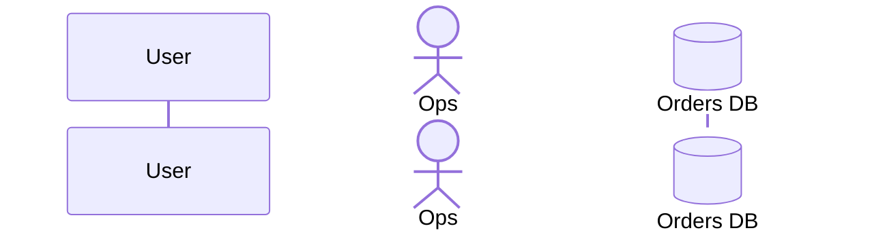

# Sequence Diagrams

Sequence diagrams are architecture diagrams whose `.mmd` file starts with `sequenceDiagram`. They are declared in `.uigraph.yaml` under `architectureDiagrams` exactly like flowcharts:

```yaml
architectureDiagrams:
  - name: Checkout Sequence
    path: .uigraph/diagrams/checkout-sequence/checkout-sequence.mmd
    contextPath: .uigraph/diagrams/checkout-sequence/context.json
```

The converter picks the sequence path when the first `flowchart` / `graph` / `sequencediagram` keyword it finds is `sequenceDiagram`. Anything else, including a file with no keyword at all, is treated as a flowchart.

## Supported Mermaid Syntax

The full https://mermaid.js.org/syntax/sequenceDiagram.html surface is supported. Write ordinary Mermaid; nothing below needs a UIGraph-specific escape hatch.

### Participants



- `participant` and `actor` both declare a lifeline; `actor` renders as a stick figure.
- Both alias forms work: `X as Name` and `@{ "alias": "Name" }`. When both are present, the `as` form wins.
- `@{ "type": ... }` accepts `participant`, `actor`, `boundary`, `control`, `entity`, `database`, `collections`, `queue`.
- Undeclared participants are created on first use, in message order. Declare them up front when column order matters.
- `create participant X` / `create actor X` attaches the lifeline at the following message; `destroy X` cuts it off at that row.

### Messages

All arrow tokens parse, including the half and reversed families. In every pair the single-dash form is a solid line and the double-dash form is dashed.

- no head: `->` and `-->`
- filled head: `->>` and `-->>`
- cross head: `-x` and `--x`
- open head: `-)` and `--)`
- bidirectional: `<<->>` and `<<-->>`
- half barb: `-|\` `-|/` `/|-` `\-` and their `--` forms (`--|\`, `--|/`, `/|--`, `\--`)
- stick: `-\` `-//` `//-` and their dashed forms (`--\`, `--//`, `//--`)

The `/|-`, `\-`, `//-` forms are reversed: the barb is drawn at the source end instead of the target end.

- `A->>+B: msg` activates B on that row; `B-->>-A: msg` deactivates. Activations stack, and `activate` / `deactivate` lines work too.
- `A()->>B` and `A->>()B` mark a central lifeline connection. `+`/`-` and `()` may appear in either order.
- Every message needs a `:` label; a line with an arrow but no colon is skipped.

### Blocks, boxes, notes

- Block openers: `loop`, `alt`, `opt`, `par`, `critical`, `break`, `rect`. Each renders as a labelled frame and nests to any depth.
- `else`, `and`, and `option` open a new section inside the current block rather than a new block.
- `rect rgb(0, 255, 0)` and `box transparent Aqua` take a leading functional color (`rgb`/`rgba`/`hsl`/`hsla`) or a bare CSS color name; anything else is read as the label, so `box Another Group` stays a plain label.
- `box ... end` groups adjacent participants into a background band.
- `Note left of X:`, `Note right of X:`, `Note over X,Y:` all render as note boxes.

### Other directives

- `autonumber`, `autonumber 10 20`, `autonumber off`.
- `title:`, `accTitle:`, `accDescr:`, and the `accDescr { ... }` block form.
- `link X: Label @ https://url` and `links X: {"Label": "https://url"}` attach actor menus.
- `%%` comments, `<br/>` line breaks, and HTML entity codes (`&#35;`, `&amp;`) are resolved at parse time.

## Context for Sequence Diagrams

Sequence context works, but the keys are **not** the participant names written in the `.mmd`. The converter generates its own node and edge IDs from the parsed diagram, and `context.nodes` / `context.edges` are matched against those generated IDs.

This is the single most important difference from flowchart context, where node keys are the Mermaid node IDs verbatim.

### Generated node IDs

| Element | Node ID | Node type |
| ------- | ------- | --------- |
| Participant / actor | `participant-<participant-id>` | `sequenceParticipant` |
| Message box | `message-<row>` | `shape` |
| Note box | `note-<row>` | `shape` |
| `loop`/`alt`/`opt`/`par`/`critical`/`break`/`rect` frame | `sequence-block-block-<n>` | `group` |
| `box ... end` band | `sequence-box-box-<n>` | `group` |
| `title:` | `sequence-title` | `text` |

`<participant-id>` is the identifier on the left of `as`, not the display alias: `participant U as User` produces `participant-U`.

`<row>` is the parser row index. Messages and notes share one counter in source order, so rows are not contiguous per kind — a note between two messages consumes a row number. Do not guess row numbers; only target `message-<row>` / `note-<row>` when you have counted the rows, and prefer targeting participants.

Edge IDs follow `<source>-<target>` over those node IDs, so each message produces two edges: `participant-U-message-0` and `message-0-participant-W`.

### What to put in context

Prefer participant context only. It is stable against edits to the diagram body:

```json
{
  "nodes": {
    "participant-DB": {
      "name": "Orders Database",
      "data": {
        "Owner": { "type": "Text Input", "value": "Data Team" },
        "Color": { "type": "Color Picker", "value": "#2563eb" }
      }
    }
  }
}
```

Rules:

- Do not set `type` on a `participant-*` node. It is already `sequenceParticipant`, and overriding it drops the lifeline, activations, and row handles.
- Do not set `___internal` on sequence nodes. Layout data (`rowCount`, `rowYs`, `lifelineHeight`, `activations`) is computed from the parsed diagram, and overwriting it desynchronizes the lifelines from the message boxes.
- Do not use `groups` in sequence context. Frames and bands come from `box` / `loop` / `alt` in the Mermaid source; a context group would fight the generated layout.
- `name` and `data` are the useful fields. `name` sets the hidden `Name` field; `data` adds or updates component fields by label.
- Participants already carry a `Color` field, so a `Color` entry in `data` recolors an existing field rather than adding one.
- `style.width` / `style.height` on a participant are honored but will not move the lifeline grid; leave them alone unless asked.

Most sequence diagrams need no `context.json` at all. Omit `contextPath` unless there is real per-participant metadata to attach.
