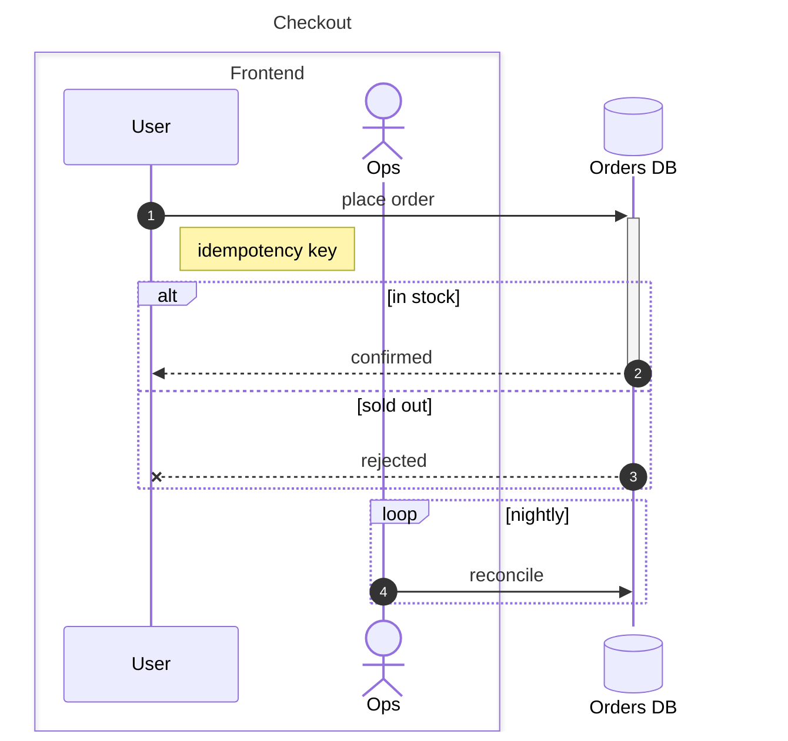

# Sequence Diagrams

A `.mmd` file starting with `sequenceDiagram`, declared in `.uigraph.yaml` under `architectureDiagrams` like any other diagram:

```yaml
architectureDiagrams:
  - name: Checkout Sequence
    path: .uigraph/diagrams/checkout-sequence/checkout-sequence.mmd
    contextPath: .uigraph/diagrams/checkout-sequence/context.json
```

## Supported Mermaid Syntax

The full https://mermaid.js.org/syntax/sequenceDiagram.html surface is supported. Write ordinary Mermaid; nothing needs a UIGraph-specific escape hatch.



That covers participants and actors, `as` and `@{ }` aliases, every arrow token, activation (`+`/`-`), blocks (`alt`/`else`, `loop`, `opt`, `par`, `critical`, `break`, `rect`), `box` bands, notes, `autonumber`, and `title`. `create` / `destroy participant`, `activate` / `deactivate`, `link`, and `accTitle` / `accDescr` all work too.

## Context

Add `context.json` when there is real per-participant metadata to attach. Key it by participant:

```json
{
  "nodes": {
    "participant-DB": {
      "name": "Orders Database",
      "style": { "color": "#2563eb" },
      "data": {
        "Owner": { "type": "Text Input", "value": "Data Team" }
      }
    }
  }
}
```

- The key is `participant-<identifier>`, using the identifier rather than the display alias: `participant U as User` and `participant DB@{ "alias": "Orders DB" }` give `participant-U` and `participant-DB`.
- `name` and `data` behave exactly as for flowchart nodes.
- `style.color` sets the participant's indicator and lifeline color. Omit it to use the default `#E2E8F0`.
